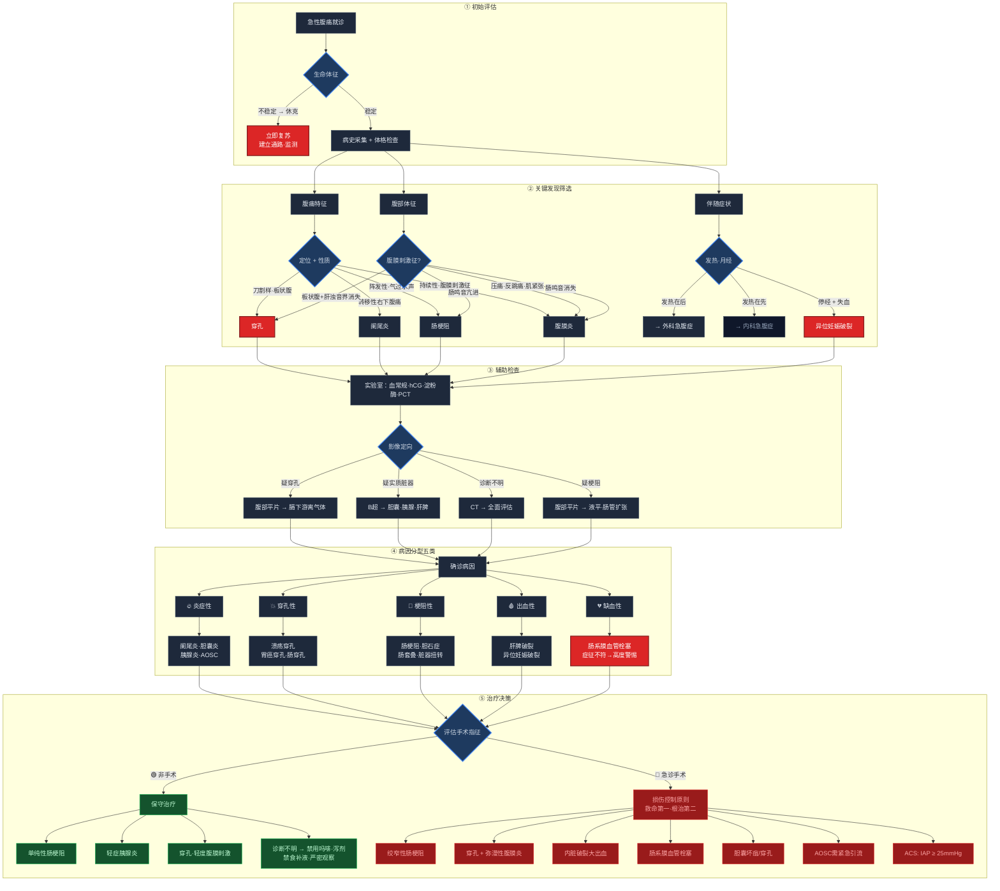

# 急腹症的诊断与鉴别诊断

**定义**：急腹症（acute abdomen）是以急性腹痛为主要表现，需要早期诊断和及时治疗的一组腹部疾病的总称。

**特点**：发病急、进展快、变化多、病情重、病因复杂；一旦延误诊治可危及生命。

## 诊断流程总览

## 腹痛机制

| 类型 | 定位 | 特点 |
|------|------|------|
| **内脏痛** | 不准确（弥散性钝痛） | 伴迷走神经兴奋症状（恶心呕吐、出汗）；刀割、针刺、烧灼等外界刺激不引起内脏痛 |
| **躯体痛** | 准确，与病变器官部位一致 | 痛感敏锐，伴明显压痛和肌痉挛 |
| **牵涉痛** | 准确，与病变器官部位不一致 | 痛感剧烈，有压痛、肌紧张和感觉过敏 |

## 病因和分类

**按病变性质分类**：

| 类别 | 常见疾病 |
|------|---------|
| **炎症性** | 急性胆囊炎、急性胰腺炎、AOSC、急性阑尾炎 |
| **穿孔性** | 胃十二指肠溃疡急性穿孔、胃癌急性穿孔、急性肠穿孔（肠伤寒、肠结核、溃疡性结肠炎、急性出血坏死性肠炎、结肠阿米巴病） |
| **梗阻性** | 胆石症、急性肠梗阻、腹腔脏器急性扭转 |
| **内脏破裂** | 肝脾破裂、异位妊娠破裂 |
| **缺血性** | 肠系膜血管缺血性疾病（栓塞/血栓）、腹主动脉瘤 |

> 肿瘤基本上为慢性病程，进展速度远不及穿孔或胰腺炎等，**不属于急腹症**。
| **其他** | 胸部疾病（急性心梗、肺炎、肋间神经痛、急性心包炎）；中毒和代谢性疾病（慢性铅中毒、急性铊中毒、DKA、肝性血卟啉病）；腹型紫癜、腹型风湿热、急性溶血 |

## 诊断

### 病史

- **性别和年龄**
- **发病诱因和既往史**：胆绞痛/急性胆囊炎常在油腻饮食后；急性胰腺炎多与暴饮暴食/饮酒有关
- **腹痛部位**：
  - 前肠来源器官 → **上腹部**
  - 中肠来源器官（十二指肠下段→横结肠右2/3段）→ **脐周**
  - 后肠来源器官 → **下腹部**
- **腹痛性质**：
  - 持续性 → 炎症/缺血/出血/肿瘤
  - 阵发性 → 空腔脏器平滑肌痉挛/梗阻
  - 持续性伴阵发性加剧 → 炎症和梗阻并存
- **常见急腹症腹痛特点**：
  - 急性阑尾炎：**转移性右下腹痛**
  - 溃疡病穿孔：**刀割样腹痛**
  - 肝破裂出血：**持续性钝痛**
  - 机械性肠梗阻：**阵发性腹痛**
  - 肠绞窄：**持续性腹痛、阵发性加剧**
    - 绞窄性肠梗阻短时间内即可出现**休克**，是与其他急腹症的重要鉴别点（其他疾病虽可急性加剧，但不易短期内休克）
- **伴随症状**：恶心呕吐、排便、发热、黄疸；泌尿系疾病多伴尿频、尿急、尿痛、血尿
- **呕吐物鉴别诊断**：

| 呕吐物特点 | 提示意义 |
|-----------|---------|
| 呕吐宿食，不含胆汁 | **幽门梗阻** |
| 呕吐物含胆汁 | 梗阻位于**十二指肠乳头开口以下** |
| 呕吐物呈咖啡色 | **上消化道出血** |
| 呕吐粪水样物 | **低位完全性肠梗阻** |
| 腹痛后随即呕吐（反射性） | 病变位置高（急性胃肠炎、高位小肠梗阻） |

- **排便情况**：
  - 腹痛后**停止排气排便** → 机械性肠梗阻
  - **腹泻** → 胃肠炎、盆腔脓肿、阑尾炎
  - **血便** → 肠绞窄坏死、肠套叠、急性出血坏死性肠炎
  - 小儿急性阑尾炎：常先有**厌食**，后出现腹痛
- **月经史和婚育史**：停经1~2个月出现腹痛、失血 → 异位妊娠破裂
  - 卵巢滤泡或黄体破裂：多发生在**两次月经之间**
  - 女性腹痛**必须考虑**输卵管异位妊娠破裂的可能性
- **预排大便感**（里急后重）：一般见于**肛周脓肿**或**盆腔积血**（如异位妊娠破裂）
- **既往史**：
  - 溃疡病史 + 突发上腹痛 → 溃疡穿孔
  - 胆囊结石史 + 腹痛黄疸 → 结石进入胆总管
  - 腹部手术史 + 阵发性腹痛 → 粘连性肠梗阻
  - 所有疑似肠梗阻的急性腹痛都要**排除腹外疝**

### 体格检查

- 一般检查：营养状况、急性面容、体位、皮肤/黏膜苍白、黄疸
  - 腹腔出血者：面色苍白、贫血貌
  - 腹膜炎者：痛苦面容、屈曲体位、不敢伸展
  - 脱水者：眼眶凹陷、皮肤皱缩
  - 胆道梗阻者：巩膜皮肤黄染
- **腹部检查**（充分显露乳头至腹股沟，按视→触→叩→听顺序）：
  - **视诊**：
    - 腹部膨隆 + 腹壁浅表静脉显现 → 肠梗阻
    - 腹部凹陷呈**舟状腹** → 消化性溃疡穿孔
    - 局部隆起伴**肠型** → 肠扭转
    - 腹股沟区肿块突出 → **嵌顿疝**
  - **触诊**（仰卧屈膝位，从无痛区开始）：
    - 压痛+反跳痛+肌紧张 = **腹膜刺激征**
    - 压痛最明显处通常即病变部位（如阑尾炎早期主诉脐周痛，右下腹已有压痛）
    - **肌紧张程度**反映腹腔炎症程度：轻度→轻度炎症/出血；明显→化脓性炎症；**板状腹**→胃十二指肠穿孔
    - ⚠️ **特殊人群**：年老体弱、儿童、肥胖、经产妇、重症感染/休克者 → 腹部体征可比实际病情**轻**
    - 男性需检查**睾丸**有无扭转
  - **叩诊**（从无痛区开始）：
    - 叩痛明显区 → 病变所在
    - 移动性浊音 → 腹水/腹腔积血
    - 肝浊音界消失 → 消化道穿孔
  - **听诊**（从脐周或右下腹开始）：
    - 肠鸣音亢进 + 高调 + **气过水声** → 机械性肠梗阻早期
    - 肠鸣音减弱或消失 → 麻痹性肠梗阻、急性腹膜炎、低血钾
- **直肠指检（DRE）**：直肠肿物、直肠子宫陷凹触痛、指套染血/黏液；不要把宫颈误认为肿物
- **腹痛与发热的关系**：外科急腹症腹痛多**先于发热**出现，早期可无发热症状

> ⚠️ **症征不符**（symptoms out of proportion to signs）：**肠系膜血管栓塞**早期→剧烈腹痛但腹膜炎体征不明显；肠坏死后→腹痛反而减轻。严重的"症征不符"常误导临床判断，需高度警惕。

**消化性溃疡穿孔**：
- 最经典体征：**腹肌强直呈板状腹**（板状腹）
  - 机制：胃酸/十二指肠液（盐酸）刺激腹膜 → 腹肌强直收缩
- 穿孔三特点：
  1. **板状腹**
  2. **肝浊音界缩小或消失**（穿孔最有价值、最具特异性的体征）
  3. **游离气体**（膈下游离气体）
- **膈下游离气体阴性的少数情况**（不能完全依赖影像学，需结合病史、症状、体征综合判断）：
  1. 穿孔位置特殊（靠近幽门部或后壁）→ 气体不易向膈下聚集
  2. 穿孔小且自发闭合 → 气体泄漏量少，难以检测
  3. 腹腔内气体量过少且分散，未能聚集于膈下
  4. 患者体位不适（未采取直立位或左侧卧位）
  5. 穿孔后就诊较早，气体尚未充分逸入腹腔
  6. 严重腹腔积液 → 液体掩盖游离气体影像

### 辅助检查

> **快速定位口诀**：B超看水，X片看气。

| 检查 | 说明 |
|------|------|
| **三大常规** | 血/尿/便常规 + hCG测定 |
| **诊断性腹腔穿刺/灌洗** | 阳性率>90%；穿刺点：脐与髂前上棘连线中外1/3或脐水平线与腋前线交点 **抽出不凝血**→脏器破裂内出血（腹膜去纤维作用） 抽不到液体不能排除内脏损伤，可重复穿刺 **DPL阳性标准**：①肉眼可见血液/胆汁/胃肠内容物/尿液 ②RBC>100×10⁹/L ③WBC>0.5×10⁹/L ④淀粉酶>34.3IU/L ⑤涂片发现细菌 **禁忌**：已明确诊断、严重腹胀、腹部既往手术、妊娠后期 |
| **腹部平片**（最常用） | 膈下游离气体、液平具有诊断提示意义 **肠梗阻X线征**： - 孤立肠段扩张且较固定 → **绞窄性肠梗阻** - 扩张肠段呈阶梯形排列 → **回肠扩张**，扩张部位以下梗阻 - 扩张肠段黏膜呈鱼刺状 → **空肠扩张**，扩张部位以下梗阻 |
| **B超** | 适用于实质性脏器损伤、破裂、占位性病变 |
| **CT/MRI** | 已成为急腹症常用诊断方法，了解病变部位、性质、范围及与周围关系 |
| **血管造影** | 适用于疑有肝破裂、胆道出血、小肠出血、肠系膜血管栓塞 |
| **内镜/腹腔镜** | 腹腔镜适用于疑难急腹症，特别是不能排除妇科急症时 |
| **PCT（降钙素原）** | 评价急腹症和外科严重感染性疾病进程及预后 |

## 鉴别诊断

外科急腹症需与以下非外科疾病鉴别：

1. **腹腔外疾病所致腹痛**：胸膜炎、急性心肌梗死、带状疱疹、肋间神经痛、全身性疾病
2. **内科急腹症**：急性胃肠炎、原发性腹膜炎、假性腹膜炎、肠系膜淋巴结炎、内分泌代谢疾病（DKA、尿毒症、肾上腺皮质危象、间歇性卟啉症）、腹型紫癜
3. **中毒**：重金属中毒
4. **妇科疾病**：宫外孕、卵巢囊肿破裂、黄体破裂、盆腔炎、卵巢囊肿扭转

### 八类常见急腹症诊断要点（教材版）

| 疾病 | 典型表现 | 关键体征 | 首选检查 |
|------|---------|---------|---------|
| **胃十二指肠溃疡穿孔** | 突发上腹刀割样剧痛，迅速蔓延全腹；既往溃疡病史 | **板状腹**、肝浊音界消失 | 立位腹部平片（膈下游离气体） |
| **急性胆囊炎** | 油腻饮食后右上腹痛，向右肩胛下放射；夜间发病易误诊"胃病" | 右上腹压痛、Murphy征(+)、肝区叩痛 | B超（胆囊壁水肿/增厚/结石） |
| **急性胆管炎** | 上腹痛 + 寒战高热 + 黄疸（Charcot三联征）；细菌易入血→脓毒血症 | 三联征 + 感染性休克 | B超 + 实验室检查 |
| **急性胰腺炎** | 暴饮暴食/饮酒后左上腹持续性剧痛，向腰背放射；**呕吐后疼痛不缓解** | 上腹压痛、腹膜刺激征 | 血尿淀粉酶 + CT（定性+分型） |
| **急性阑尾炎** | **转移性右下腹痛**（始于脐周/上腹→固定右下腹） | 右下腹固定压痛；穿孔后全腹膜炎但右下腹压痛最重 | 临床诊断为主，B超/CT辅助 |
| **急性肠梗阻** | 腹痛+腹胀+停止排气排便+呕吐（痛、胀、闭、吐） | 肠鸣音亢进→减弱（绞窄时）；气过水声 | 立位腹部平片（液气平面） |
| **腹部闭合伤** | 需鉴别实质脏器破裂出血 vs 空腔脏器穿孔 vs 血管损伤 | 出血→心率↑血压↓；穿孔→腹膜炎体征 | CT/B超 + 诊断性腹腔穿刺 |
| **妇产科急症** | 异位妊娠（停经+失血）、卵巢囊肿扭转（突发剧痛）、盆腔炎（下腹痛+发热） | 宫颈触痛、后穹窿穿刺不凝血/脓液 | hCG + 盆腔B超 |

## 急性化脓性腹膜炎（病理生理）

> 急腹症最常见并发症。按病因分原发性和继发性；继发性占绝大多数（空腔脏器穿孔、外伤、炎症扩散）。

**病理生理**：胃肠内容物+细菌入腹腔 → 腹膜充血水肿、浆液性渗出 → 巨噬细胞+中性粒细胞浸润 → 脓液形成。大肠埃希菌为主→黄绿色脓液，混合感染→稠厚+粪臭味。

**结局取决于**：①全身+腹膜防御能力 ②细菌种类/数量/感染时间。轻者局限→吸收痊愈；中者包裹→局限性脓肿（膈下/盆腔/肠间）；重者扩散→感染性休克→MODS→死亡。

**转归**：治愈后腹腔内多有粘连，可致粘连性肠梗阻。

### 腹腔脓肿（三种类型）

| 类型 | 临床表现 | 诊断 | 治疗 |
|------|---------|------|------|
| **膈下脓肿** | 持续高热、肋缘下/剑突下钝痛、呃逆、季肋区叩痛、皮肤凹陷性水肿 | B超/CT；超声引导穿刺（诊断+治疗） | 经皮穿刺置管引流（首选，80%治愈）；切开引流少用 |
| **盆腔脓肿** | **直肠/膀胱刺激征**（里急后重、黏液便、尿频）；全身中毒症状较轻（盆腔吸收能力弱） | 直肠指诊（前壁触痛+波动感肿块）；阴道后穹窿穿刺 | 小者→抗生素+热敷理疗；大者→经直肠/阴道切开引流 |
| **肠间脓肿** | 化脓感染症状 + 腹胀/腹痛/腹部肿块；可并发粘连性肠梗阻 | 立位X线片（肠壁间距增宽）；B超/CT | 抗生素+支持治疗；无效或肠梗阻→剖腹探查；贴近腹壁→经皮穿刺引流 |

## 治疗原则

### 各病种手术与非手术治疗选择

**消化性溃疡穿孔**：
- 大多经内科治疗可痊愈
- 穿孔后轻中度腹膜刺激征 → 先保守治疗
- 腹膜刺激征严重 → 手术
- ① 消化道穿孔**不是**剖腹手术的绝对适应证
- **首选检查**：腹部平片（看膈下游离气体）
- 胃十二指肠溃疡出血 → 首选**胃镜**；穿孔 → 首选**腹部平片**

**急性胰腺炎**：
- 胰液外漏 → 重度腹膜刺激征 → 手术
- 一般急性胰腺炎 → 内科治疗
- ② 血淀粉酶升高**不是**急性胰腺炎手术的指征
- **腹胀**与严重程度呈**正相关**；腹痛程度和淀粉酶升高幅度与严重程度**不成正相关**

**肠梗阻**：
- ① 单纯性肠梗阻 → 非手术治疗
- ② 绞窄性和完全性梗阻（常并发缺血，导致肠壁缺血坏死）→ 手术解除梗阻，而**并非只有明确诊断绞窄时才可手术**
- ③ 粘连性肠梗阻（易发生完全梗阻或绞窄性梗阻）→ 及时手术

**肠套叠**（记忆：汉堡包层层叠叠）：
- **果酱样血便**（酱） + **腊肠样肿块**（火腿）

**肠系膜血管栓塞**：
- 导致肠管功能下降，对肠内容物吸收水分的能力减弱 → **腹泻**

**阑尾炎各型腹痛特点**：
- 单纯性阑尾炎：**隐痛或钝痛**
- 化脓性阑尾炎：**胀痛或剧痛**
- 坏疽性阑尾炎：**持续性剧烈腹痛**
- 穿孔性阑尾炎：腹痛因阑尾腔压力骤减，**暂时减轻**后，又**持续加剧**

**特殊腹痛类型**：
- **刀割痛** → 上消化道穿孔
- **钻顶样痛** → 胆道蛔虫症

**胆总管结石**（Charcot三联征）：
- **腹痛** + **黄疸** + **发热**，间歇性发作
- 首选检查：**B超**（经济便捷，简单快速）
- 明确诊断：**MRCP**（MRI看水——胆道内全是胆汁/水）

**先有发热后腹痛的急腹症**：
- 应先判断急腹症的原因
- ① 胰液外漏 → 手术
- ② 腹膜感染 → 无需手术

### 一般原则（教材五要点）

1. **尽快明确诊断，针对病因治疗**。暂时不能明确诊断者→留院观察、禁食补液、严密监测，进一步检查明确
2. **诊断未明确时**：❌ **禁用吗啡等强效镇痛药**（掩盖病情），禁用泻剂、灌肠
3. **需手术探查/治疗者**：必须根据病情进行充分的术前准备
4. **诊断不明确但有手术探查指征者**（具备以下任一即手术）：
   - ① 脏器血运障碍（如肠坏死）
   - ② 感染不能局限或有扩散倾向
   - ③ 腹部活动性出血
   - ④ 排除内科疾病，非手术治疗无改善/恶化，特别是出现生命体征不稳定或器官功能障碍
5. **手术原则**：**救命第一，根治第二**
   - 方案力求简单有效；条件许可时尽量一次性解决
   - 病情危重→遵循**损伤控制（damage control）原则**：先解决危及生命的主要问题，待全身平稳后再行根治
   - 急诊**腹腔镜手术**现已广泛应用：创伤小、恢复快，对疑难复杂病人尤有助益

**剧烈腹部绞痛的急腹症**：
- 特点：发作突然、疼痛剧烈
- 常见：胆绞痛、肠绞痛、肾绞痛
- 处理：迅速建立静脉通路，同时快速测血压、心率及腹部体检；生命体征稳定者可适当用镇痛、解痉药物，疼痛减轻后再做检查

## 腹腔间隔室综合征（ACS）

- **定义**：腹内压（IAP）≥20mmHg，伴与腹腔高压有关的器官功能衰竭
- **正常腹内压**：5~7mmHg（接近大气压）；IAP≥12mmHg为腹腔高压
- **病因**：
  - ① 腹壁因素：深度烧伤焦痂收缩、腹壁缺血水肿、巨大疝修补术后勉强关腹 → 腹壁顺应性降低
  - ② 腹腔因素：腹腔内大出血、器官严重水肿、胃肠扩张、肠系膜静脉栓塞、腹水/积脓；大量液体复苏（大面积烧伤、重症胰腺炎）均可致IAP增高
- **病理生理**：IAP↑ → 下腔静脉受压→回心血↓→血压↓；膈肌抬高→低氧血症+高碳酸血症；肾静脉受压→肾血流↓→少尿/无尿；肠系膜血流↓→肠肝缺血
- **测量**：通过**膀胱内测压**（最常用，易操作，可重复）：排空尿液→注入100ml生理盐水→仰卧位耻骨联合为零点→呼气时测压
- **诊断标准**：IAP **≥20mmHg** + 器官功能障碍
- **手术指征**：非手术治疗无效，IAP持续 **>25mmHg** 且威胁生命 → **腹腔开放**
- **非手术治疗**：液体复苏、利尿脱水、机械正压通气、促进胃肠排空、经皮穿刺引流腹水（超声/CT引导）
- **手术方式**：正中纵切口或打开原切口 → 清除血块/积液 → 非粘连性合成网片覆盖 → 尽早确定性手术恢复腹腔生理环境

> **记忆**：2025 → 诊断20，手术25
