# 骨科诊断与治疗总览

> 按体格检查流程重组：每一步以体征/体格发现为分叉依据，逐层收窄至诊断与处理。

```mermaid
flowchart TD
    classDef emergency fill:#dc2626,stroke:#7f1d1d,color:#fff,stroke-width:2px
    classDef decision fill:#1e3a5f,stroke:#3b82f6,color:#cbd5e1,stroke-width:2px
    classDef process fill:#1e293b,stroke:#475569,color:#e2e8f0
    classDef diag fill:#1e3a5f,stroke:#60a5fa,color:#93c5fd
    classDef surgical fill:#991b1b,stroke:#dc2626,color:#fca5a5
    classDef nonsurgical fill:#14532d,stroke:#22c55e,color:#bbf7d0

    S["骨科患者"]:::process

    %% ── L1 视诊：有无可见畸形 ──
    S --> V1{"视诊: 可见畸形?"}:::decision
    V1 -->|"有"| V2{"外伤史?"}:::decision
    V2 -->|"有"| V3{"骨擦感/反常活动?"}:::decision
    V3 -->|"有"| V4{"部位?"}:::decision

    %% 外伤+畸形+骨擦感 = 骨折
    V4 -->|"上肢"| V5{"受力机制?"}:::decision
    V5 -->|"摔伤·手掌撑地"| V6{"部位?"}:::decision
    V6 -->|"腕·餐叉样"| D1["Colles骨折<br/>掌倾角·尺倾角消失"]:::diag
    V6 -->|"肘·肘后三角正常"| D2["肱骨髁上骨折(伸直型)<br/>→ 警惕5P征"]:::emergency
    V6 -->|"肩·方肩"| D3["肱骨外科颈骨折"]:::diag
    V6 -->|"前臂·成角"| D4{"压痛在尺骨or桡骨?"}:::decision
    D4 -->|"尺骨·桡骨头脱位"| D4a["Monteggia"]:::diag
    D4 -->|"桡骨·下尺桡脱位"| D4b["Galeazzi"]:::diag
    D4 -->|"双骨均压痛"| D4c["尺桡骨双骨折"]:::diag

    V5 -->|"直接暴力"| V7{"部位?"}:::decision
    V7 -->|"肱骨干"| V8{"垂腕? 虎口麻木?"}:::decision
    V8 -->|"有"| D5["肱骨干骨折+桡神经损伤<br/>→ 探查修复"]:::surgical
    V8 -->|"无"| D5a["单纯肱骨干骨折"]:::diag

    V4 -->|"下肢"| V9{"下肢短缩+外旋?"}:::decision
    V9 -->|"是·大转子叩痛"| V10{"囊内?"}:::decision
    V10 -->|"是·腹股沟压痛"| V11{"Garden分型?"}:::decision
    V11 -->|"I-II"| D6["股骨颈骨折→空心钉"]:::nonsurgical
    V11 -->|"III-IV"| D6a["股骨颈骨折→关节置换"]:::surgical
    V10 -->|"否·大转子瘀斑"| D7["转子间骨折→PFNA"]:::surgical
    V9 -->|"否·小腿成角"| D8["胫腓骨骨折<br/>→ 监测骨筋膜室"]:::emergency

    V4 -->|"脊柱"| V12{"下肢感觉·运动?"}:::decision
    V12 -->|"消失"| D9["完全性脊髓损伤<br/>ASIA A→甲泼尼龙+减压"]:::emergency
    V12 -->|"部分保留"| D10["不完全脊髓损伤<br/>→ 急诊减压固定"]:::emergency
    V12 -->|"正常"| D11["单纯压缩骨折<br/>→ 卧床保守"]:::nonsurgical

    V4 -->|"骨盆"| V13{"血压下降? 休克?"}:::decision
    V13 -->|"是"| D12["骨盆骨折大出血<br/>→ 骨盆带+外固定+栓塞"]:::emergency
    V13 -->|"否"| D13["骨盆骨折→Tile分型处理"]:::diag

    %% 外伤+畸形+无骨擦感 = 脱位
    V3 -->|"无·关节空虚感"| V14{"部位?"}:::decision
    V14 -->|"肩·Dugas(+)"| D14["肩关节脱位<br/>→ Hippocrates复位"]:::diag
    V14 -->|"肘·肘后三角消失"| D15["肘关节脱位"]:::diag
    V14 -->|"髋·下肢内旋短缩"| D16["髋关节后脱位<br/>→ 警惕坐骨神经"]:::emergency
    V14 -->|"髋·外展外旋"| D17["髋关节前脱位"]:::diag
    V14 -->|"桡骨小头·牵拉史"| D18["桡骨头半脱位<br/>→ 手法复位"]:::diag

    %% 无外伤+畸形 = 先天性/发育性
    V2 -->|"无·自幼"| V15{"部位?"}:::decision
    V15 -->|"髋·Trendelenburg(+)"| V16{"Ortolani/Barlow?"}:::decision
    V16 -->|"6月内(+)"| D19["CDH→Pavlik吊带"]:::nonsurgical
    V16 -->|"6月以上"| D20["CDH→闭合/切开复位"]:::surgical
    V15 -->|"足·内收内翻"| D21["马蹄内翻足→Ponseti"]:::nonsurgical
    V15 -->|"脊柱·Cobb>40°"| D22["脊柱侧弯→支具/矫形"]:::surgical
    V15 -->|"颈·歪头"| D23["肌性斜颈→松解"]:::diag
    V15 -->|"膝·O/X型腿"| D24["膝内翻/外翻→截骨"]:::surgical

    %% ── L2 视诊阴性 → 触诊：有无红肿热 ──
    V1 -->|"无"| P1{"触诊: 红肿·皮温高?"}:::decision
    P1 -->|"有"| P2{"全身发热?"}:::decision
    P2 -->|"有·高热"| P3{"年龄?"}:::decision
    P3 -->|"儿童"| P4{"压痛在干骺端or关节?"}:::decision
    P4 -->|"干骺端·环形压痛"| D25["急性血源性骨髓炎<br/>→ 血培养+MRI+钻孔引流"]:::diag
    P4 -->|"关节·各方向活动痛"| D26["化脓性关节炎<br/>→ 关节穿刺+紧急引流"]:::emergency
    P3 -->|"成人·慢性窦道"| D27["慢性骨髓炎<br/>→ 死骨清除+肌瓣填塞"]:::surgical

    P2 -->|"无·低热盗汗"| P5{"部位?"}:::decision
    P5 -->|"脊柱·拾物试验(+)"| D28["脊柱结核<br/>→ 抗结核2-4周后手术"]:::diag
    P5 -->|"髋·Thomas(+)"| D29["髋关节结核<br/>→ 抗结核+手术·2年"]:::diag
    P5 -->|"膝·浮髌试验(+)"| D30["膝关节结核"]:::diag

    P2 -->|"无·痛风石"| D31["痛风性关节炎<br/>→ 秋水仙碱"]:::diag

    %% ── L3 触诊阴性 → 压痛点定位 ──
    P1 -->|"无"| T1{"触诊: 压痛点?"}:::decision
    T1 -->|"有·局限性骨压痛"| T2{"夜间痛加重?<br/>阿司匹林缓解?"}:::decision
    T2 -->|"是"| D32["骨样骨瘤"]:::diag
    T2 -->|"否"| T3{"X线: 骨质破坏?"}:::decision
    T3 -->|"边界清·皂泡样"| D33["骨巨细胞瘤<br/>禁忌放疗"]:::diag
    T3 -->|"Codman三角"| D34["骨肉瘤→化疗+保肢"]:::diag
    T3 -->|"葱皮样"| D35["尤因肉瘤"]:::diag
    T3 -->|"穿凿样·本周蛋白"| D36["多发性骨髓瘤"]:::diag
    T3 -->|"多发性·年龄大"| D37["骨转移瘤"]:::diag
    T3 -->|"囊性透亮"| D38["骨囊肿→病理骨折风险"]:::diag
    T3 -->|"外生性·背离关节"| D39["骨软骨瘤"]:::diag
    T3 -->|"钙化·成人"| D40["软骨肉瘤→手术"]:::surgical

    T1 -->|"有·关节线压痛"| T4{"关节积液?"}:::decision
    T4 -->|"是·浮髌(+)"| T5{"单侧or双侧?"}:::decision
    T5 -->|"单侧·外伤后"| T6{"McMurray?"}:::decision
    T6 -->|"(+)"| D41["半月板损伤→关节镜"]:::surgical
    T6 -->|"(-)"| T7{"抽屉/Lachman?"}:::decision
    T7 -->|"(+)"| D42["交叉韧带损伤→重建"]:::surgical
    T7 -->|"(-)"| D43["创伤性滑膜炎"]:::nonsurgical
    T5 -->|"双侧·对称"| T8{"晨僵>1h?"}:::decision
    T8 -->|"是"| D44["类风湿关节炎<br/>→ 甲氨蝶呤"]:::diag
    T8 -->|"否·远端指间"| D45["骨关节炎<br/>→ 三级阶梯"]:::nonsurgical
    T4 -->|"否·无积液"| T9{"疼痛弧?"}:::decision
    T9 -->|"是·肩上举60-120°"| D46["肩袖损伤→保守/关节镜"]:::diag
    T9 -->|"否·肩各方向均受限"| D47["冻结肩→康复锻炼"]:::nonsurgical
    T9 -->|"否·肘外上髁"| D48["网球肘(Mills+)"]:::diag
    T9 -->|"否·腕桡侧"| D49["狭窄性腱鞘炎(Finkelstein+)"]:::diag

    T1 -->|"有·棘突/椎旁"| T10{"神经放射痛?"}:::decision
    T10 -->|"有·上肢"| T11{"Eaton?"}:::decision
    T11 -->|"(+)"| D50["神经根型颈椎病→ACDF"]:::diag
    T11 -->|"(-)"| D51["颈椎病(其他型)"]:::diag
    T10 -->|"有·下肢"| T12{"直腿抬高?"}:::decision
    T12 -->|"(+)"| T13{"鞍区麻木?"}:::decision
    T13 -->|"有"| D52["马尾综合征→急诊"]:::emergency
    T13 -->|"无"| D53["腰椎间盘突出<br/>L4-S1好发"]:::diag
    T12 -->|"(-)"| D54["腰椎管狭窄→减压"]:::surgical

    T1 -->|"有·骶髂关节"| T14{"HLA-B27?"}:::decision
    T14 -->|"(+)"| D55["强直性脊柱炎<br/>→ 柳氮磺吡啶"]:::diag
    T14 -->|"(-)"| T15{"抗O?"}:::decision
    T15 -->|"(+)"| D56["风湿性关节炎<br/>→ 青霉素防复发"]:::diag
    T15 -->|"(-)"| T16{"dsDNA? Sm?"}:::decision
    T16 -->|"(+)"| D57["SLE→泼尼松·羟氯喹·CTX"]:::diag

    %% ── L4 压痛点阴性 → 活动度 ──
    T1 -->|"无明确压痛"| R1{"主动活动vs被动活动?"}:::decision
    R1 -->|"主动不能·被动可"| R2{"部位?"}:::decision
    R2 -->|"肩·落臂征"| D58["巨大肩袖撕裂→手术"]:::surgical
    R2 -->|"手指·弹响指"| D59["扳机指→封闭/松解"]:::diag
    R2 -->|"多关节·对称"| D60["RA(早期·无肿胀)"]:::diag

    R1 -->|"主动被动均受限"| R3{"部位?"}:::decision
    R3 -->|"肩"| D61["冻结肩→康复"]:::nonsurgical
    R3 -->|"髋·腹股沟痛"| R4{"MRI?"}:::decision
    R4 -->|"信号异常·无塌陷"| D62["股骨头坏死I-II期<br/>→ 保髋·髓芯减压"]:::nonsurgical
    R4 -->|"塌陷"| D63["股骨头坏死III-IV期<br/>→ 关节置换"]:::surgical
    R3 -->|"多关节·晨僵"| D64["OA/RA→查RF·抗CCP鉴别"]:::diag

    %% ── L5 活动度正常 → 神经症状 ──
    R1 -->|"均正常·但神经症状"| N1{"运动障碍模式?"}:::decision
    N1 -->|"垂腕·虎口麻木"| D65["桡神经损伤→修复"]:::surgical
    N1 -->|"猿手·拇指对掌不能"| D66["正中神经损伤→修复"]:::surgical
    N1 -->|"爪形手·夹纸(+)"| D67["尺神经损伤→修复"]:::surgical
    N1 -->|"足下垂"| D68["腓总神经损伤"]:::surgical
    N1 -->|"足跖屈不能"| D69["胫神经损伤"]:::surgical
    N1 -->|"脊髓压迫征"| N2{"Hoffmann?"}:::decision
    N2 -->|"(+)"| D70["脊髓型颈椎病<br/>→ 禁止推拿·手术"]:::emergency
    N2 -->|"(-)"| N3{"椎体束征?"}:::decision
    N3 -->|"(+)"| D71["胸椎管狭窄/占位"]:::diag

    %% ── L6 全部阴性 → 影像导向 ──
    N1 -->|"无神经症状"| I1{"X线/MRI所见?"}:::decision
    I1 -->|"骨质破坏"| I2{"边界?"}:::decision
    I2 -->|"清"| D72["良性骨肿瘤"]:::diag
    I2 -->|"不清"| D73["恶性骨肿瘤/转移"]:::diag
    I1 -->|"关节间隙窄"| D74["OA→阶梯治疗"]:::nonsurgical
    I1 -->|"骨质疏松"| I3{"轻微外伤后痛?"}:::decision
    I3 -->|"是"| D75["骨质疏松性骨折<br/>→ 椎体成形/PKP"]:::surgical
    I3 -->|"否"| D76["骨质疏松→内科治疗"]:::nonsurgical
    I1 -->|"正常"| D77["非器质性/随访观察"]:::endpoint

    %% 骨折总治疗
    D1 & D3 & D4c & D5a & D11 --> TX{"并发症监测"}:::decision
    TX -->|"5P征"| TX_E["骨筋膜室综合征<br/>→ 立即切开减压"]:::emergency
    TX -->|"无"| TX_R["复位·固定·功能锻炼"]:::nonsurgical
```



## 阅读路径

```
                    ┌─ 有外伤 ──→ 骨擦感? ──┬─ 有 → 骨折 (按部位/受力)
                    │                       └─ 无 → 脱位 (Dugas/肘后三角/牵拉史)
视诊: 可见畸形? ──┤
                    └─ 无外伤 ──→ 自幼畸形 (Ortolani/Barlow/Cobb/Ponseti)

                    ┌─ 全身高热 → 儿童(干骺端vs关节) → 骨髓炎/化脓性关节炎
触诊: 红肿皮温高? ─┤
                    └─ 低热盗汗 → 拾物试验/Thomas → 骨关节结核

                    ┌─ 局限性骨压痛 → 夜间痛/影像破坏 → 骨肿瘤(良/恶)
                    │
压痛点定位? ──────┼─ 关节线压痛 → 浮髌/积液 → 半月板/韧带/关节炎
                    │
                    ├─ 棘突椎旁 → 神经放射 → Eaton/直腿抬高 → 颈椎病/椎间盘
                    │
                    └─ 骶髂关节 → HLA-B27/抗O/dsDNA → AS/风湿/SLE

                    ┌─ 主动不能·被动可 → 肌腱问题 (肩袖/扳机指)
活动度检查? ──────┤
                    └─ 均受限 → 冻结肩/股骨头坏死(MRI)/关节炎

                    ┌─ 垂腕/猿手/爪形手 → 周围神经损伤
神经症状? ────────┤
                    └─ 脊髓压迫 → Hoffmann(+) → 脊髓型颈椎病(禁止推拿)

全部阴性? ────────→ 影像导向 (骨质破坏/骨疏松/关节间隙)
```
